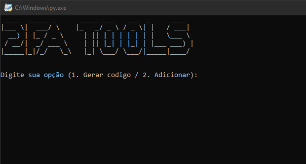

 # 2FA Tools

## Ferramenta de Gerenciamento OTP code.

## Descrição
Ferramenta em Python para gerenciamento de códigos OTP, permitindo gerar, salvar e organizar seus códigos 2FA de forma prática e segura.

Funcionalidades:
- Sistema de login seguro protegido por hash.
- Gerenciamento de serviços: Gerar código / Registrar novo serviço.
- Armazenamento local de Chave OTP criptografada.

## Libs:
- Sqlite
- pycryptodome
- hashlib

Objetivo:
Facilitar o gerenciamento de autenticação de Dois Fatores.

